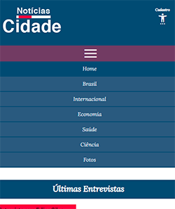
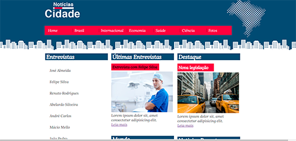

# Projeto-Site-Cidade
#
#

 

#
#

### Projeto mostra uma página de site responsivo para celular com menu escondido.
#
#
# objetivo:
### Praticar a responsividade da media query e menu através do javaScript. 
#
#

    
    
    

    

#
#

    
    

#
<a href="https://projeto-site-cidade.vercel.app/" style="font-size:24px;">Visualizar página</a>

